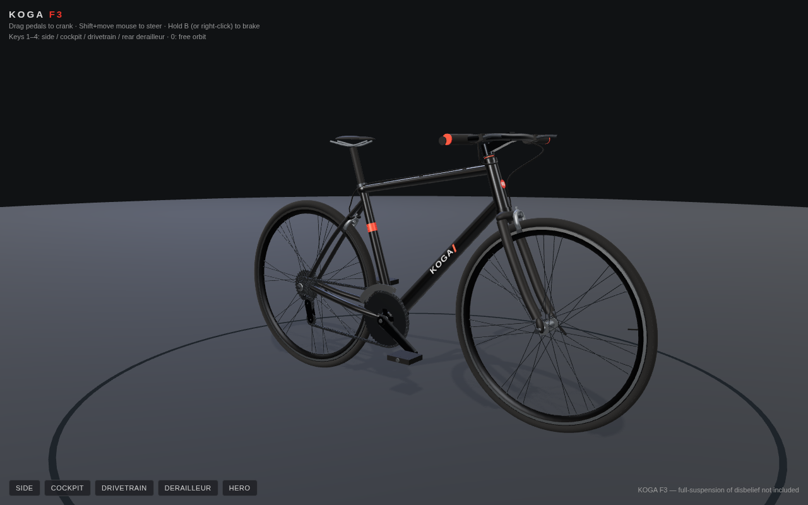

# Koga F3 — Three.js

A fully modeled, animated, interactive Koga F3 fitness/road bike built from
scratch in Three.js. No external models or textures — every component is
procedural geometry and canvas-generated PBR textures.



## Run it

```bash
npm install
npm run serve        # then open http://localhost:8000
```

## Controls

| Input | Action |
|---|---|
| Drag the pedals/cranks | Crank the drivetrain — chain, cassette and wheels follow at the true 50/17 gear ratio |
| `P` | Toggle auto-pedalling |
| Shift + move mouse | Steer the bars/fork; the bike leans into the turn with speed-scaled physics |
| Hold `B` or right-click | Pull the brake levers — calipers squeeze the rims, wheels decelerate |
| Left-drag / wheel / middle-drag | Orbit, zoom, pan (full camera rig) |
| `1`–`4`, `0` | Saved viewpoints: side profile, cockpit POV, drivetrain closeup, rear derailleur, hero |

## What's modeled

- **Frame** — hydroformed double-butted alloy look: tapered ovalised tubes,
  BB shell, head tube with flared cups, junction gussets, forged rear
  dropouts, bottle bosses, KOGA down-tube decals and F3 head badge.
- **Fork & cockpit** — full-carbon fork (tapered steerer, sculpted crown,
  raked blades, hooded dropouts), stem, backswept flat bar, lock-on grips,
  brake levers with working blades.
- **Wheels** — 28h 3-cross laced spokes with nipples, asymmetric rear hub,
  semi-aero rims with machined brake tracks, 700x28c tires, QR skewers.
- **Drivetrain** — 50/34 crankset on forged arms, platform pedals that stay
  level, 10-speed cassette (11–32), front + rear derailleurs, and a chain
  solved as an exact belt path (common tangents around chainring, engaged
  cog and both jockey wheels) with ~110 instanced roller-chain links that
  slide along the path.
- **Brakes** — dual-pivot calipers with correct pad kinematics, full cable
  runs from the levers along the top tube to both calipers.
- **Physics** — freehub engagement (pedal to drive, coast to freewheel),
  brake deceleration, steering with lean-into-the-turn dynamics.

## Development

```bash
node tools/shoot.mjs <label>   # headless renders of every viewpoint to shots/
                               # + appends a numbered frame to iterations/
node tools/verify.mjs          # interaction A/B verification shots
```

The `iterations/` folder is a time-lapse of the build, one frame per
iteration. See `PROGRESS.md` for the build log.
